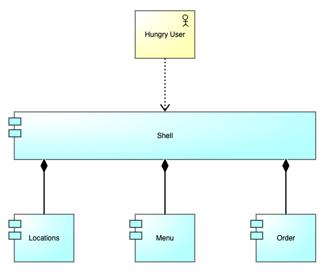

# NG Grill

This is a micro frontend architecture demo using Module Federation to create a website for a fictitious restaurant.

If you want to follow along, here is the software I already have installed:

| Software    | Version |
| ----------- | ------- |
| Node        | 14.18.1 |
| NPM         | 7.24.2  |

## Architecture

Here is a super high level architecture for what we're about to build.



Each of these is a fully-featured Angular application. Locations, Menu, and Order are our micro frontends, and of course shell will be our shell that composes everything together.

## Generate Shell and Micro Frontends

I start off by generating an Nx workspace.
I then add my applications for the shell and micro frontends.

```sh
npx create-nx-workspace@latest --name ng-grill --preset empty --nx-cloud false
cd ng-grill
npm install --save-dev @nrwl/angular
npx nx generate @nrwl/angular:app shell --mfe --mfeType host --style scss --routing true
npx nx generate @nrwl/angular:app locations --mfe --mfeType remote --port 4201 --host shell --style scss --routing true
npx nx generate @nrwl/angular:app menu --mfe --mfeType remote --port 4202 --host shell --style scss --routing true
npx nx generate @nrwl/angular:app order --mfe --mfeType remote --port 4203 --host shell --style scss --routing true
```

## Generate Menu Components

Next, I generate some menu components to show how we can include multiple pages within a micro frontend.

```sh
npx nx generate @nrwl/angular:component --project menu remote-entry/breakfast
npx nx generate @nrwl/angular:component --project menu remote-entry/lunch
npx nx generate @nrwl/angular:component --project menu remote-entry/dinner
```

## Update apps/mfe/src/app/app.component.html

- apps/locations/src/app/app.component.html
- apps/menu/src/app/app.component.html
- apps/order/src/app/app.component.html

```html
<router-outlet></router-outlet>
```

## Update apps/shell/src/app/app.component.html

```html
<main>
  <h2>Links</h2>
  <ul>
    <li><a routerLink="">Home</a></li>
    <li><a routerLink="locations">Locations</a></li>
    <li><a routerLink="menu">Menu</a></li>
    <li><a routerLink="order">Order</a></li>
  </ul>
</main>
```

## Update apps/mfe/src/app/app.module.ts

- apps/locations/src/app/app.module.ts
- apps/menu/src/app/app.module.ts
- apps/order/src/app/app.module.ts

```ts
  RouterModule.forRoot([
    {
      path: '',
      loadChildren: () => import('./remote-entry/entry.module').then((m) => m.RemoteEntryModule),
    },
  ], { initialNavigation: 'enabledBlocking' }),
```

## Update apps/mfe/src/app/remote-entry/entry.module.ts

- apps/locations/src/app/remote-entry/entry.module.ts
- apps/menu/src/app/remote-entry/entry.module.ts
- apps/order/src/app/remote-entry/entry.module.ts

Replace `BrowserModule` with `CommonModule`.

## Update apps/locations/src/app/remote-entry/entry.component.ts

```html
<h2>Locations</h2>
<p>Our locations system is currently undergoing scheduled maintenance.</p>
```

## Update apps/menu/src/app/remote-entry/entry.component.ts

```html
<h2>Menu</h2>
<ul>
  <li><a routerLink="breakfast">Breakfast</a></li>
  <li><a routerLink="lunch">Lunch</a></li>
  <li><a routerLink="dinner">Dinner</a></li>
</ul>
<router-outlet></router-outlet>
```

## Update apps/order/src/app/remote-entry/entry.component.ts

```html
<h2>Order</h2>
<p>Our online order system is currently undergoing scheduled maintenance.</p>
```

## Update apps/menu/src/app/remote-entry/entry.module.ts

```ts
children: [
  {
    path: 'breakfast',
    component: BreakfastComponent,
  },
  {
    path: 'lunch',
    component: LunchComponent,
  },
  {
    path: 'dinner',
    component: DinnerComponent,
  },
],
```

## Run Everything

```sh
npx nx run shell:serve-mfe
```

## Voilà!

Visit http://localhost:4200 to see the micro frontend architecture in action.
